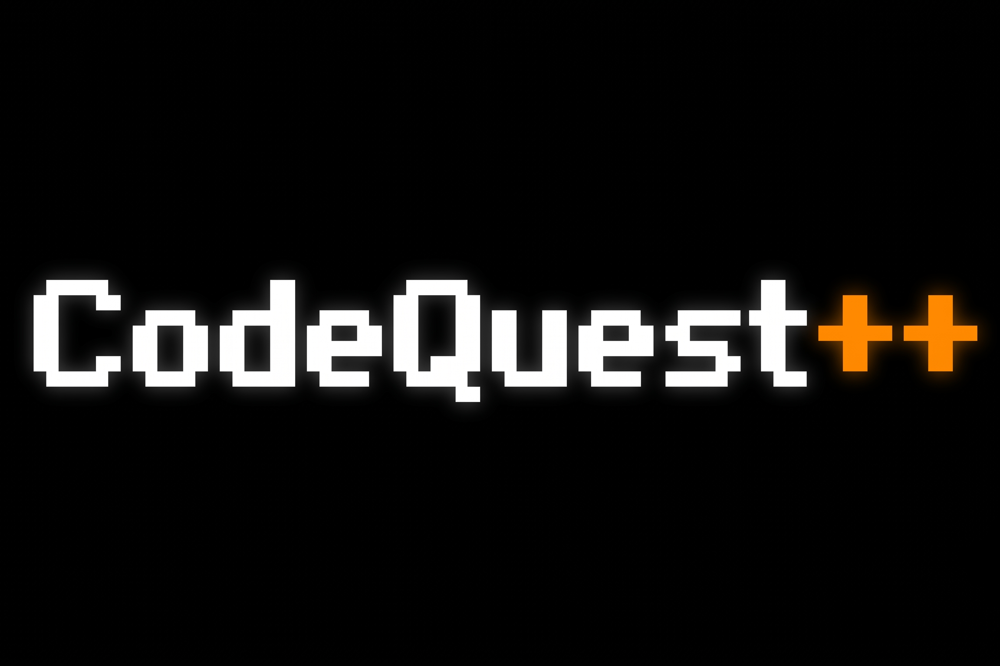

<p align="center">
  
</p>

<p align="center">
  <strong>Port Direct2D e motor de renderização gráfica acelerada por GPU do RPG tático CodeQuest++ em C++17.</strong>
</p>

<p align="center">
  <a href="https://isocpp.org/"></a>
  <a href="https://learn.microsoft.com/en-us/windows/win32/direct2d/direct2d-portal"></a>
  <a href="https://cmake.org/"></a>
  <a href="https://learn.microsoft.com/windows/"></a>
  <a href="LICENSE"></a>
  
</p>

---

<p align="center">
  <strong>Idiomas / Languages:</strong><br>
  <strong>Português</strong> &nbsp;|&nbsp; <a href="README_EN.md"><strong>English</strong></a>
</p>

---

## Sumário

- [Visão Geral](#visão-geral)
- [Recursos Principais](#recursos-principais)
- [Estrutura Arquitetural](#estrutura-arquitetural)
- [Classes, Raças e Sistemas](#classes-raças-e-sistemas)
- [Controles do Jogo](#controles-do-jogo)
- [Compilação e Execução](#compilação-e-execução)
  - [Pré-requisitos](#pré-requisitos)
  - [Scripts Rápidos (Recomendado)](#scripts-rápidos-recomendado)
  - [Compilação Manual via CMake](#compilação-manual-via-cmake)
  - [Executando o Jogo](#executando-o-jogo)
- [Pipeline Gráfico e Renderização Direct2D](#pipeline-gráfico-e-renderização-direct2d)
- [Retrospectiva de Engenharia (Port do Terminal para D2D)](#retrospectiva-de-engenharia-port-do-terminal-para-d2d)
- [Licença](#licença)

---

## Visão Geral

**CodeQuestPlusPlus** é o port gráfico oficial e evolução arquitetural do jogo de RPG original em terminal (**CodeQuestPlusPlus-Terminal**), migrando do ambiente de console em caracteres para uma aplicação nativa com renderização acelerada por GPU em **Direct2D** e tipografia vetorial **DirectWrite** em **C++17**.

O projeto preserva todas as regras de domínio, combate tático, exploração em pseudo-3D (*Raycasting*) e sistemas de progressão do original, enquanto substitui integralmente a camada de exibição:
- Elimina as restrições de taxa de quadros e cintilação (*flicker*) do console Win32.
- Adiciona suporte a texturas gráficas em alta resolução (PNG) para paredes, portas, pisos, tetos e sprites 2D em Pixel Art.
- Renderiza interfaces de usuário (HUD, inventário, diálogos, minimapa e menus) com aceleração gráfica direta por hardware.
- Incorpora o ícone nativo multi-resolução diretamente na tabela PE do executável via Win32 Resource Compiler (`windres`), dispensando privilégios de administrador para execução.

Tudo isso mantendo a filosofia central de **zero dependências externas pesadas** (sem SDL, SFML, GLFW, Unreal ou Unity), operando exclusivamente através das APIs nativas do Microsoft Windows.

---

## Recursos Principais

- **Motor de Renderização Raycaster 3D Texturizado**:
  - Projeção tridimensional em tempo real com paredes mapeadas por textura, portas interativas, tetos, pisos e iluminação dinâmica com atenuação de distância.
  - Renderização de sprites direcionais em Pixel Art para monstros, NPCs e elementos de cenário projetados em buffers Direct2D.
- **Pipeline Gráfico Direct2D & DirectWrite**:
  - Camada de interface acelerada por hardware com suporte a transparência alfa, layouts flexíveis e animações fluidas a 60+ FPS.
  - Renderização vetorial subpixel de fontes via DirectWrite (`dwrite`), garantindo leitura nítida e de alto contraste.
  - Decodificação nativa de texturas e imagens utilizando Windows Imaging Component (WIC) e GDI+.
- **Sistema de Combate em Turnos**:
  - Mecânica dinâmica de aparo (**Parry**) baseada em tempo de reação (timing preciso), reduzindo ou anulando o dano recebido.
  - Habilidades ativas exclusivas por classe, magias arcanas, inventário em batalha e consumíveis táticos.
  - IA de monstros com árvores de drop, cálculo dinâmico de atributos físicos/mágicos e resistências elementais.
- **Sistemas de RPG Abrangentes**:
  - **5 Classes Jogáveis**: Arqueiro (*Archer*), Bardo (*Bard*), Mago (*Mage*), Necromante (*Necromancer*), Guerreiro (*Warrior*).
  - **5 Raças com Atributos Únicos**: Anão (*Dwarf*), Elfo (*Elf*), Humano (*Human*), Orc (*Orc*), Clone Necrótico (*NecroClone*).
  - Gestão de inventário completa, slots de equipamentos (armas, armaduras, escudos), consumíveis, materiais e itens de missão.
  - Bestiário dinâmico com histórico de criaturas derrotadas e Diário de Aventuras em tempo real.
- **Mundo Expansivo em Mapas Interconectados**:
  - **Mapa 1 (Vila Inicial)**: NPCs interativos de serviço (Ferreiro, Alquimista, Comerciante de Comida, Padre).
  - **Mapa 2 (Floresta Sombria)**: Labirinto com encontros selvagens e baús de tesouro.
  - **Mapa 3 (Ponte do Reino)**: Travessia estratégica com patrulhas.
  - **Mapa 4 (Castelo Real)**: Área do trono, guardas e eventos de história.
  - Minimapa 2D em tempo real e visualizador de mapa-múndi em tela cheia.
- **Entrada Nativa Win32 (Teclado + Mouse)**:
  - Captura direta de eventos de teclado e mouse com baixa latência através do loop de mensagens Win32 (`PeekMessage`), sem necessidade de elevação UAC.

---

## Estrutura Arquitetural

O projeto adota separação estrita de responsabilidades em camadas desacopladas:

```
CodeQuestPlusPlus/
├── CMakeLists.txt              # Configuração raiz do CMake
├── build_clean.bat             # Atalho de build limpo completo (raiz)
├── build_incremental.bat       # Atalho de build incremental rápido (raiz)
├── compilar_inicio.bat         # Alias em português para build_clean.bat
├── compilar_mudancas.bat       # Alias em português para build_incremental.bat
├── README.md                   # Documentação em Português (Port Direct2D)
├── README_EN.md                # Documentação em Inglês (Direct2D Port)
├── LICENSE                     # Licença GNU GPLv3
├── assets/                     # Recursos visuais e gráficos
│   ├── classes/                # Sprites das classes de personagens em Pixel Art
│   ├── doors/                  # Texturas de portas para o Raycaster
│   ├── floors/                 # Texturas de chão
│   ├── icons/                  # Ícones da aplicação (icon.png, icon2.png, icon.ico)
│   ├── races/                  # Sprites das raças de personagens
│   ├── terrain/                # Texturas de ambiente e terreno
│   ├── trees/                  # Sprites de árvores e folhagem
│   ├── walls/                  # Texturas de paredes para o Raycaster
│   └── worldMap.png            # Textura do mapa-múndi
├── bin/                        # Diretório de saída dos binários compilados
│   └── CodeQuestPlusPlus.exe   # Executável Direct2D com ícone embutido
├── docs/                       # Relatórios técnicos e guias de tradução
├── scripts/                    # Scripts de automação de build (Windows)
│   ├── build_clean.bat         # Clean build completo (MSYS2/CMake)
│   ├── build_incremental.bat   # Recompilação incremental rápida
│   ├── compilar_inicio.bat     # Build limpo (PT)
│   └── compilar_mudancas.bat   # Build incremental (PT)
├── terminal/                   # Documentação de referência da versão original de terminal
└── src/                        # Código-fonte principal em C++17
    ├── main.cpp                # Ponto de entrada WinMain e loop principal de mensagens
    ├── resources/              # Recursos Win32 (resource.rc com ícone embutido)
    ├── core/                   # Motor central, janela Win32, D2DContext, Input, Logger
    │   ├── config/             # Configurações do jogo e constantes
    │   ├── d2d-context/        # Inicialização do Direct2D e DirectWrite
    │   ├── input/              # Gerenciador de teclado e mouse Win32
    │   ├── logger/             # Sistema de logs de diagnóstico
    │   ├── state/              # Máquina de estados (StateManager, GameContext)
    │   ├── utils/              # Funções de diálogo, buffer e keybindings
    │   └── window/             # Encapsulamento da GameWindow Win32
    ├── entities/               # Entidades de jogo e regras de domínio
    │   ├── character/          # Entidade de jogador e atributos
    │   ├── classes/            # Hierarquia de classes (Archer, Bard, Mage, Necromancer, Warrior)
    │   ├── enemies/            # Arquétipos de inimigos e IA tática
    │   ├── npcs/               # Lógica e diálogos de NPCs
    │   └── races/              # Hierarquia de raças (Dwarf, Elf, Human, Orc, NecroClone)
    ├── maps/                   # Layouts de mapas, lógica de zonas e colisões
    ├── rendering/              # Camada de renderização gráfica
    │   ├── direct-2d/          # Pipeline Direct2D, gerenciador de texturas e GridEmulator
    │   └── raycaster/          # Motor 3D Raycaster e renderizadores de tela
    ├── systems/                # Mecânicas de jogo
    │   ├── combat/             # Motor de combate por turnos e mecânica de Parry
    │   ├── inventory/          # Sistema de inventário, equipamentos e fábrica de itens
    │   └── progress/           # Bestiário, Diário e controle de flags de missão
    └── ui/                     # Telas de interface gráfica e adaptadores UI
```

---

## Classes, Raças e Sistemas

### Classes Disponíveis
| Classe | Especialidade | Habilidade Chave |
| :--- | :--- | :--- |
| **Archer** | Agilidade e Dano Crítico à Distância | Disparos múltiplos perfurantes e esquiva |
| **Bard** | Suporte Tático e Modificadores de Status | Canções de cura, buffs de moral e atordoamento |
| **Mage** | Alto Dano Elemental Mágico | Feitiços arcanos, manipulação de mana e barreiras |
| **Necromancer** | Drenagem de Vida e Magia das Sombras | Absorção de essência vital e invocações sombrias |
| **Warrior** | Tanque de Alta Defesa e Força Bruta | Golpes devastadores e maestria em parry/bloqueio |

### Raças
- **Anão (*Dwarf*)**: Alta constituição física, armadura natural e resistência a veneno.
- **Elfo (*Elf*)**: Bônus de destreza, evasão elevada e afinidade arcana natural.
- **Humano (*Human*)**: Atributos equilibrados com alta adaptabilidade e crescimento versátil.
- **Orc (*Orc*)**: Força física superior, alta resiliência e fúria em combate.
- **Clone Necrótico (*NecroClone*)**: Foco em atributos sombrios, alta afinidade mágica e resistência necrótica.

---

## Controles do Jogo

| Tecla / Ação | Função | Contexto |
| :---: | :--- | :--- |
| <kbd>W</kbd> / <kbd>↑</kbd> | Mover para a Frente / Avançar | Exploração (Raycaster 3D) |
| <kbd>S</kbd> / <kbd>↓</kbd> | Mover para Trás / Recuar | Exploração (Raycaster 3D) |
| <kbd>A</kbd> / <kbd>←</kbd> | Girar para a Esquerda | Exploração (Raycaster 3D) |
| <kbd>D</kbd> / <kbd>→</kbd> | Girar para a Direita | Exploração (Raycaster 3D) |
| <kbd>E</kbd> | Interagir (Portas, Baús, NPCs) | Exploração (Raycaster 3D) |
| <kbd>M</kbd> | Alternar Minimapa 2D | Exploração (Raycaster 3D) |
| <kbd>I</kbd> | Abrir Inventário de Itens | Geral |
| <kbd>C</kbd> | Ficha de Atributos do Personagem | Geral |
| <kbd>J</kbd> | Abrir Diário de Aventuras | Geral |
| <kbd>B</kbd> | Abrir Bestiário de Monstros | Geral |
| <kbd>ESC</kbd> | Menu de Pausa / Voltar | Geral |
| <kbd>1</kbd> - <kbd>4</kbd> | Selecionar Ação (Atacar, Magia, Item, Fugir) | Combate por Turnos |
| <kbd>Espaço</kbd> / <kbd>F</kbd> | Executar **Parry** no Momento do Golpe | Combate por Turnos |
| <kbd>Setas</kbd> / <kbd>Mouse</kbd> | Navegar pelas Opções | Menus / Telas Interativas |
| <kbd>Enter</kbd> / <kbd>Clique Esquerdo</kbd> | Confirmar Seleção | Menus / Telas Interativas |

---

## Compilação e Execução

### Pré-requisitos

1. **Sistema Operacional**: Windows 10 ou Windows 11 (requer bibliotecas Direct2D nativas).
2. **Compilador C++17**: MinGW-w64 (MSYS2 UCRT64 recomendado em `C:\msys64\ucrt64\bin`) ou GCC/Clang compatível.
3. **CMake**: Versão 3.10 ou superior instalada e presente no `PATH`.

### Scripts Rápidos (Recomendado)

O repositório fornece scripts `.bat` automatizados para build rápido:

- **Build Limpo (Do Zero)**:
  ```cmd
  .\build_clean.bat
  ```
  *(ou `.\compilar_inicio.bat` ou `scripts\build_clean.bat`)*

- **Build Incremental (Apenas alterações)**:
  ```cmd
  .\build_incremental.bat
  ```
  *(ou `.\compilar_mudancas.bat` ou `scripts\build_incremental.bat`)*

### Compilação Manual via CMake

Caso prefira compilar manualmente via linha de comando:

```bash
# 1. Configurar variáveis de ambiente do compilador (se necessário)
set PATH=C:\msys64\ucrt64\bin;%PATH%

# 2. Configurar diretório de build
cmake -G "MinGW Makefiles" -S . -B build -DCMAKE_BUILD_TYPE=Release

# 3. Compilar o projeto com todos os núcleos disponíveis
cmake --build build -j
```

### Executando o Jogo

O binário compilado com o ícone embutido é gerado em `bin/CodeQuestPlusPlus.exe`.

```powershell
.\bin\CodeQuestPlusPlus.exe
```

---

## Pipeline Gráfico e Renderização Direct2D

A transição da versão terminal para Direct2D baseia-se em três pilares fundamentais de arquitetura:

1. **Pipeline de Hardware Direct2D (`ID2D1HwndRenderTarget`)**:
   - Criação de render target nativo associado à janela Win32 com suporte a buffer duplo (*double buffering*), eliminando oscilações e sincronizando a apresentação na taxa de atualização do monitor.
2. **Projeção de Raycasting em Buffers de Bitmap**:
   - O motor de raycasting calcula as colunas de parede, distância euclidiana, coordenadas de textura UV e iluminação, gravando diretamente em um bitmap de alta velocidade projetado na GPU.
3. **Motor Tipográfico DirectWrite (`IDWriteFactory`)**:
   - Renderização vetorial de fontes TrueType/OpenType com anti-aliasing subpixel ClearType, permitindo caixas de diálogo, logs de combate e textos de status de alta fidelidade visual.

---

## Retrospectiva de Engenharia (Port do Terminal para D2D)

O desenvolvimento deste port representou a evolução técnica das lições obtidas no projeto de terminal:

1. **Superação dos Gargalos de Console**: A versão em terminal exigia truques agressivos de alocação de buffers de string na CPU para evitar oscilações. Com o Direct2D, a renderização foi delegada à GPU, atingindo 60+ FPS fluidos e consistentes.
2. **Desacoplamento por Interfaces**: A adoção prévia do padrão de inversão de dependência em telas (`IScreenCombatUI`, `IDefeatUI`, `IVictoryUI`) permitiu portar toda a lógica de jogo sem necessidade de reescrever as regras de combate, inventário e progressão.
3. **Recursos Nacionais e Empacotamento PE**: O jogo agora conta com sprites e texturas completas em formato PNG decodificadas nativamente via WIC/GDI+, além do ícone do aplicativo embutido diretamente no executável final através do `resource.rc`.

---

## Licença

Este projeto é software livre e está licenciado sob os termos da **GNU General Public License v3.0 (GPLv3)**. Para mais detalhes, consulte o arquivo [LICENSE](LICENSE).
